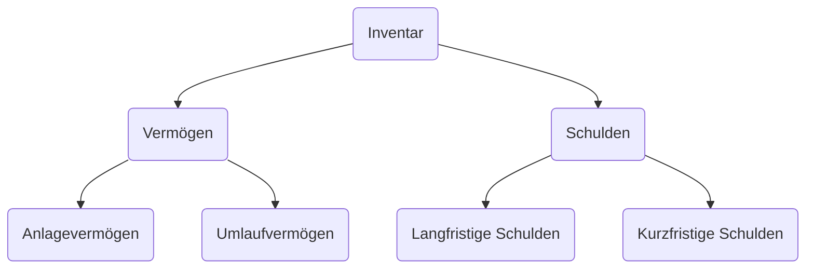

## Einfache Buchhaltung
- ein Buch
- betriebliche einnahmen und ausgaben chronologisch
- gegenüberstellung der einnahmen und ausgaben an Jahresende ([#Einnahmen-Überschuss-Rechnung](#Einnahmen-%C3%9Cberschuss-Rechnung))

## Doppelte Buchhaltung
- mehrere Bücher
- Gliederung nach Soll und Haben
- Gewinnermittlung aus Bilanz und Gewinn - und Verlust - Rechnung

### Einnahmen-Überschuss-Rechnung
- Einnahmen und Ausgaben werden gegenübergestellt
- Am Ende bleibt Gewinn oder Verlust
- Gewinn / Verlust = Betriebseinnahmen - Betriebsausgaben

### Anlagevermögen (AV)
- längerer Zeitraum (über 1 Jahr) im Unternehmen
- z.B. Grundstücke, Maschinen, Wertpapiere

**Arten:**
1. **Sachanlage**
	- materiell
	- langfristig im Unternehmen (mindestens 12 Monate)
	- Maschinen, Büroeinrichtung

2. **Immaterielle Anlagen**
	- ungreifbar
	- Lizenzen, Patente

3. **Finanzanlagen**
	- monetär
	- langfristig
	- Wertpapiere, Finanzanlagen

### Umlaufvermögen (UV)
- kurze Zeit (unter 1 Jahr)

**Bestandteile:**
1. Vorräte
2. Forderungen
3. Liquide Mittel
4. Wertpapiere

### Fremdkapital (FK)
- Schulden des Unternehmens in Bilanz
- gehört fremden Kapitalgebern
- Schulden des Unternehmens

**Bestandteile:**
1. **Rückstellungen:**
	- ungewisse Verbindlichkeiten
	- Höhe und Bestehen nicht konkret
	  
1. **Verbindlichkeiten:**
	- finanzielle Verpflichtungen des Unternehmens (Schuldner) gegenüber Dritten (Gläubiger)
	- **Verbindlichkeiten**
	- **Erhaltene Anzahlungen**
	- **Verbindlichkeiten gegenüber Kreditinstituten**
	- **Verbindlichkeiten aus Lieferungen**
	- **Verbindlichkeiten aus Wechseln**
	- **Sonstige Verbindlichkeiten**

### Eigenkapital (EK)
- eigenem Kapitalanteil
- steht unbefristet zur Verfügung
- keine Rückzahlungspflicht

**Bestandteile:**
1. **Gezeichnetes Kapital**
	- verpflichtet bei Gründung Kapitaleinlage zu Hinterlegen (Stammeinlage / Grundkapital)
	- diese Einlage + spätere Kapitalerhöhungen
1. **Kapitalrücklagen**
	- finanzielle Reserven gewährleisten

### Inventar

Eigenkapital = Vermögen - Schulden