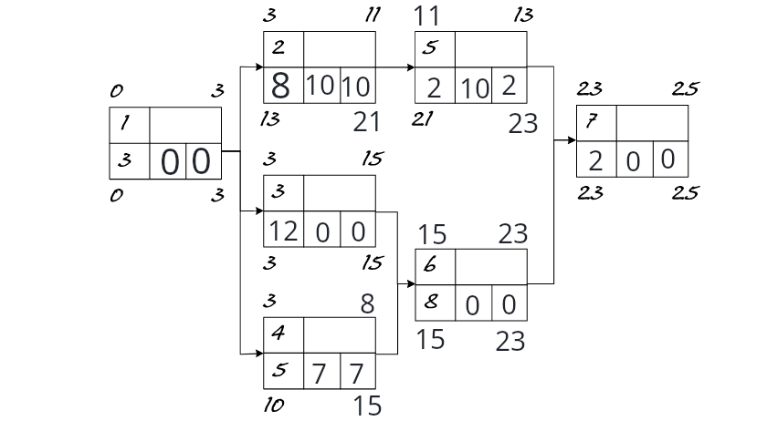

# Übungen 1
1. Dauer, Buffer
2. Gesamtpuffer: differenz zwischen SEZ und FEZ
	freier Puffer: FAZ des Nachfolgers - FEZ des Vorgängers
3. Verzögerungen bei Projektvorgängen wirken sich auf das ganze Projekt aus.

4. 
5. 
NR | Vorgangsbezeichnung | Dauer in Tagen | Unmittelbarer Vorgänger | Unmittelbarer Nachfolger
---|---------------------|----------------|-------------------------|-------------------------
1 | ziel definieren | 1 | - | 2
2 | werbeagentur wählen | 29 | 2 | 3, 4
3 | Werbekampagne entwickeln | 15 | 2 | 5
4 | Presseinformation | 13 | 2 | 5
5 | Werbekampagne durchführen | 35 | 3, 4 | 6
6 | Erfolgskontrolle | 14 | 5 | -

6. 
NR | Vorgangsbezeichnung | Dauer in Tagen | Unmittelbarer Vorgänger | Unmittelbarer Nachfolger
---|---------------------|----------------|-------------------------|-------------------------
1 | Kick-Off Meeting aller Beteiligten | 1 | - | 2, 3, 4
2 | Strukturierte Verkabelung legen | 5 | 1 | 5
3 | Gepächbandzugang herstellen | 7 | 1 | 5
4 | Zusätzl. Beleuchtung installieren | 3 | 1 | 10
5 | Servicetrsen montieren | 8 | 2, 3 | 6, 7, 8
6 | Tontechnik installieren | 1 | 5 | 12
7 | PC-Hardware installieren | 2 | 5 | 9
8 | Gepäckwaagen einbauen | 5 | 5 | 10
9 | Netzwerk logisch einrichten | 1 | 7 | 10
10 | Beschilderung anbringen | 1 | 8, 9, 4 | 11
11 | Mobiliar einrichten | 1 | 10 | 12
12 | Testphase und Abnahme | 1 | 6, 11 | -
 
 
# Übungen 2
1. 

2. 

NR | Dauer in Tagen | Unmittelbarer Vorgänger  
---|----------------|-------------------------
1 | 5 | -
2 | 20 | 1
3 | 3 | 2
4 | 18 | 3
5 | 12 | 3
6 | 5 | 3
7 | 14 | 4
8 | 10 | 5
9 | 6 | 7
10 | 5 | 8
11 | 2 | 9, 10
12 | 3 | 6, 11

a)

b) Er kann um 11 Tage verschoben werden. Es handelt sich um den Gesamtpuffer.