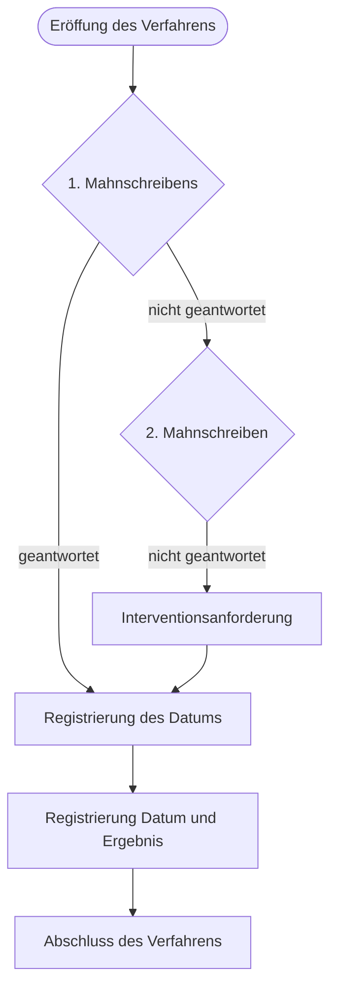

```mermaid
graph TD
	id1([Eröffung des Verfahrens])-->id2{1. Mahnschreibens}
	id2-- geantwortet -->id3[Registrierung des Datums]
	id2-- nicht geantwortet -->id4{2. Mahnschreiben}
	id4-- nicht geantwortet -->id5[Interventionsanforderung]
	id5-->id3
	id3-->id6[Registrierung Datum und Ergebnis]
	id6-->id7[Abschluss des Verfahrens]
```

